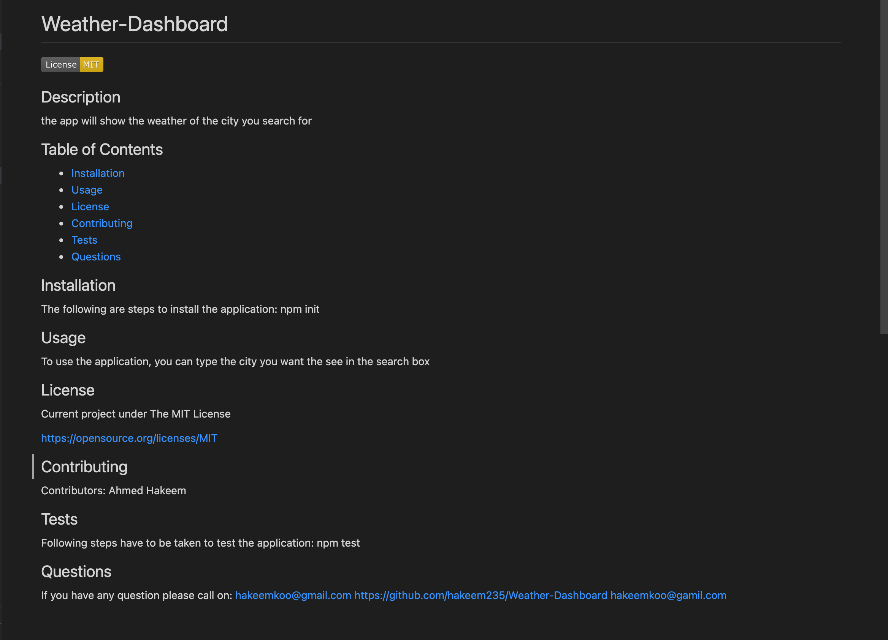

# Good-README-Generator

# Professional-README-Generator

## Table of contents
 * [General info](#General-Info)
 * [Specifics](#Specifics)
 * [Video Link](#Video-Link)
 * [Screenshots](#Screenshots)
 * [Github repo](#Github-repob)

# General Info

 The application generate good quality README file.

# Specifics

To run the app user have to open the integrated terminal and write node index.js and answer all the question will apper  

# Video Link

 You can view a demo of the generator by following the link
 [https://youtu.be/hDt4QGF7GBk](https://youtu.be/hDt4QGF7GBk)

# Screenshots

# Github-repob 
[link](https://github.com/hakeem235/Good-README-Generator)
